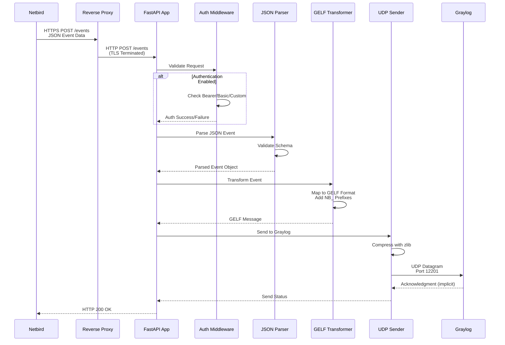

# NB_Streamer: Architecture & Technology Stack Analysis

**Repository**: NB_Streamer (Netbird Event Streaming Receiver)  
**Analysis Date**: January 2025  
**Implementation Status**: Documentation Phase (No Code Present)

## Technology Stack Identification

### Core Languages & Frameworks
- **Primary Language**: Python 3.10+
- **HTTP Framework**: FastAPI
  - Chosen for async capabilities, automatic OpenAPI documentation, and Pydantic validation
  - Will provide `/events` POST endpoint and `/health` health check
- **ASGI Server**: Uvicorn for production deployment

### Data Processing Libraries
- **JSON Processing**: Python built-in `json` module
- **Compression**: Python built-in `zlib` for GELF message compression
- **Networking**: Python built-in `socket` for UDP/TCP communication
- **Logging**: Python built-in `logging` module with JSON formatting

### Data Stores
- **No Persistent Storage**: Stateless, in-memory event processing
- **No Database Dependencies**: Pure event forwarding service
- **Configuration Storage**: Environment variables only

### Messaging & Protocols
- **Input Protocol**: HTTP POST with JSON payload
- **Output Protocol**: GELF (Graylog Extended Log Format)
- **Transport**: Compressed UDP datagrams (default), TCP fallback
- **Default Ports**: 
  - Internal HTTP: 8080
  - Graylog GELF: 12201

### Authentication Systems
- **Multiple Auth Methods**:
  - None (open endpoint)
  - Bearer Token (`Authorization: Bearer <token>`)
  - Basic Authentication (base64 encoded)
  - Custom Header authentication
- **Configuration**: Environment variable driven

### Containerization & Deployment
- **Container Runtime**: Docker
- **Base Image**: `python:3.10-slim` (lightweight Python runtime)
- **Orchestration**: Docker Compose
- **Security**: Non-root user execution (`USER nobody`)
- **Reverse Proxy**: External TLS termination (Nginx/Traefik)

### Development & Testing Tools
- **Testing Framework**: Pytest
- **HTTP Testing**: httpx for API mocking
- **Socket Testing**: Mock UDP/TCP for integration tests
- **Dependency Management**: pip + requirements.txt
- **Version Control**: Git

### External Service Dependencies
- **Event Source**: Netbird VPN platform
- **Log Destination**: Graylog server/cluster
- **Infrastructure**: External reverse proxy for TLS

## System Architecture

```mermaid
graph TB
    %% External Systems
    NB[Netbird VPN Platform]
    RP[Reverse Proxy<br/>TLS Termination<br/>Nginx/Traefik]
    GL[Graylog Server<br/>Log Analysis Platform]
    
    %% NB_Streamer Container
    subgraph "Docker Container: NB_Streamer"
        direction TB
        
        %% FastAPI Application
        subgraph "FastAPI Application (Port 8080)"
            direction TB
            EP[/events Endpoint<br/>HTTP POST]
            HC[/health Endpoint<br/>Health Check]
            
            %% Authentication Middleware
            AUTH[Authentication Middleware<br/>Bearer/Basic/Custom/None]
            
            %% Processing Components
            PARSER[JSON Event Parser<br/>Pydantic Validation]
            TRANS[GELF Transformer<br/>NB_ Field Prefixing]
            COMP[Compression Engine<br/>zlib GELF Compression]
            
            %% Output Handler
            UDP[UDP Sender<br/>Socket Interface]
        end
        
        %% Configuration
        ENV[Environment Variables<br/>AUTH_TYPE, GRAYLOG_HOST, etc.]
    end
    
    %% Setup & Deployment
    SETUP[Interactive Setup Script<br/>Python-based Configuration]
    COMPOSE[Generated docker-compose.yml<br/>Deployment Configuration]
    
    %% Data Flow Connections
    NB -->|HTTPS POST /events<br/>JSON Events| RP
    RP -->|HTTP POST<br/>Internal Network| EP
    
    EP --> AUTH
    AUTH --> PARSER
    PARSER --> TRANS
    TRANS --> COMP
    COMP --> UDP
    
    UDP -->|Compressed GELF<br/>UDP:12201| GL
    
    %% Configuration Flow
    SETUP -->|Generates| COMPOSE
    ENV -->|Configures| AUTH
    ENV -->|Configures| UDP
    
    %% Health Monitoring
    RP -->|Health Checks| HC
    
    %% Styling
    classDef external fill:#e1f5fe,stroke:#01579b,stroke-width:2px
    classDef container fill:#f3e5f5,stroke:#4a148c,stroke-width:2px
    classDef app fill:#e8f5e8,stroke:#1b5e20,stroke-width:2px
    classDef config fill:#fff3e0,stroke:#e65100,stroke-width:2px
    
    class NB,RP,GL external
    class AUTH,PARSER,TRANS,COMP,UDP app
    class ENV,SETUP,COMPOSE config
```

## Data Flow Architecture

### Event Processing Pipeline



## Event Transformation Schema

### Input Format (Netbird JSON)
```json
{
  "ID": "event-123",
  "Timestamp": "2025-07-30T12:00:00Z",
  "Message": "Peer connected",
  "InitiatorID": "peer-abc",
  "TargetID": "peer-def",
  "Meta": {"ip": "10.0.0.1"},
  "Reference": "https://netbird.io/log/123"
}
```

### Output Format (GELF JSON)
```json
{
  "version": "1.1",
  "host": "peer-abc",
  "short_message": "Peer connected",
  "timestamp": 1756617600,
  "level": 6,
  "full_message": "Peer connected - Meta: {\"ip\": \"10.0.0.1\"}",
  "NB_ID": "event-123",
  "NB_TIMESTAMP": "2025-07-30T12:00:00Z",
  "NB_INITIATOR_ID": "peer-abc",
  "NB_TARGET_ID": "peer-def",
  "NB_REFERENCE": "https://netbird.io/log/123",
  "NB_META": {"ip": "10.0.0.1"}
}
```

## Configuration Architecture

### Environment Variables
| Variable | Purpose | Default | Required |
|----------|---------|---------|----------|
| `PORT` | Internal HTTP port | 8080 | No |
| `AUTH_TYPE` | Authentication method | none | No |
| `AUTH_SECRET` | Auth token/password | - | If auth enabled |
| `AUTH_CUSTOM_HEADER` | Custom auth header name | - | If custom auth |
| `GRAYLOG_HOST` | Graylog server address | - | Yes |
| `GRAYLOG_PORT` | Graylog GELF port | 12201 | No |
| `GRAYLOG_PROTOCOL` | Transport protocol | udp | No |
| `DEFAULT_HOST` | Fallback GELF host | netbird-streamer | No |

### Setup Script Architecture
The interactive setup script (`setup.py`) will:
1. Prompt for configuration values with validation
2. Generate `docker-compose.yml` with populated environment variables
3. Provide deployment instructions

## Performance & Scalability Architecture

### Performance Targets
- **Throughput**: 100 events/second sustained
- **Latency**: <100ms per event processing
- **Resource Usage**: Minimal memory footprint

### Scalability Design
- **Stateless Processing**: No shared state between requests
- **Horizontal Scaling**: Multiple container instances supported
- **Load Balancing**: Compatible with external load balancers

## Security Architecture

### Authentication Layers
- Multiple configurable methods matching Netbird options
- Environment variable-based secrets (no hardcoded values)
- Input validation via Pydantic models

### Container Security
- Non-root user execution (`USER nobody`)
- Minimal base image (python:3.10-slim)
- No privilege escalation required

## Current Implementation Status

**Phase 1 Implementation Complete**:
- ✅ Comprehensive project specifications
- ✅ Architecture design documents  
- ✅ Technology stack implemented
- ✅ Production-ready application

**Implementation Status**:
- ✅ Complete application code in `src/` directory
- ✅ Docker configuration files (Dockerfile, docker-compose.yml)
- ✅ Dependency management (requirements.txt, requirements-dev.txt, pyproject.toml)
- ✅ Comprehensive testing infrastructure (unit, integration, e2e)
- ✅ Development environment with full Graylog stack
- ✅ Multi-tenant GELF transformation system
- ✅ Production deployment guides

**Status**: Production-ready service actively processing Netbird events with GELF output to Graylog.

---

*This architecture analysis reflects the implemented system. The project has evolved from documentation-only to a fully functional, production-ready event streaming service.*
