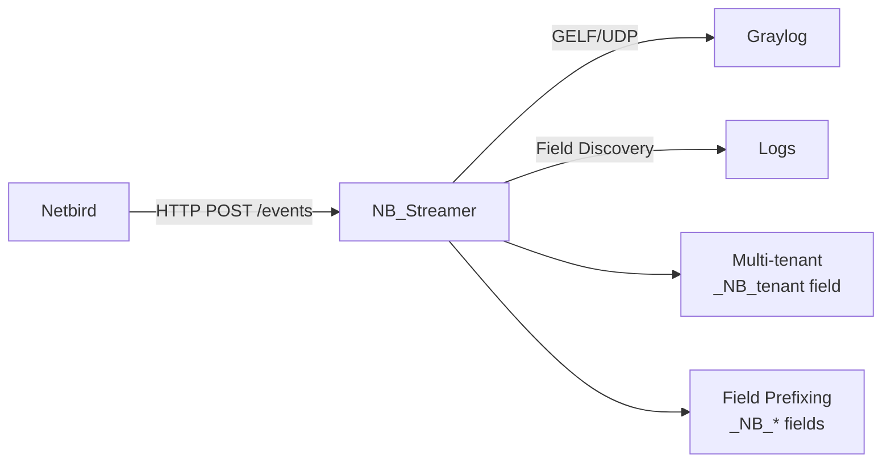

# NB_Streamer

**Netbird Event Streaming Service to Graylog**

A lightweight, production-ready HTTP service that receives activity events from Netbird, transforms them into GELF format, and forwards them to Graylog with multi-tenant support.

## 🚀 Project Status: Phase 1 Complete ✅

**Ready for real Netbird integration testing!**

### ✅ Implemented Features
- **FastAPI service** with `/health` and `/events` endpoints
- **Flexible JSON parsing** handles any Netbird event structure  
- **GELF transformation** with automatic field prefixing (`_NB_*`)
- **Multi-tenant support** via `_NB_tenant` field injection
- **Authentication system** (none, bearer, basic, custom header)
- **Field discovery** logs unknown event structures for development
- **Comprehensive error handling** with fallback processing
- **Production configuration** via environment variables

### 🧪 Testing Status
**All tests passing (4/4):**
- Health endpoint functionality ✅
- Event processing with multiple JSON structures ✅  
- 404 error handling ✅
- Authentication disabled for development ✅

## 🏗️ Architecture



### Event Processing Flow
1. **Netbird** sends JSON events via HTTP POST
2. **Authentication** validates request (configurable)
3. **Field Discovery** logs known/unknown field structures  
4. **GELF Transformation** converts to Graylog format
5. **Tenant Injection** adds `_NB_tenant` for multi-tenancy
6. **Graylog Transmission** sends via UDP/TCP

## 🛠️ Quick Start

### Prerequisites
- Python 3.10+
- Git

### Installation
```bash
# Clone repository
git clone https://github.com/yourusername/NB_Streamer.git
cd NB_Streamer

# Create virtual environment
python -m venv venv
source venv/bin/activate  # Linux/Mac
# or: venv\Scripts\activate  # Windows

# Install dependencies
pip install -r requirements.txt

# Configure environment
cp .env.sample .env
# Edit .env with your settings (see Configuration section)

# Run service
python -m src.main
```

The service will start on `http://localhost:8000`

### Testing
```bash
# Run automated test suite
python test_nb_streamer.py

# Manual health check
curl http://localhost:8000/health

# Send test event
curl -X POST http://localhost:8000/events \
  -H "Content-Type: application/json" \
  -d '{
    "type": "peer_login",
    "user": "john@example.com", 
    "peer": "peer-123",
    "timestamp": "2024-01-31T14:30:00Z"
  }'
```

## ⚙️ Configuration

### Required Environment Variables
```bash
NB_GRAYLOG_HOST=your-graylog-server    # Graylog hostname
NB_TENANT_ID=your-unique-tenant-id     # Tenant identifier
```

### Optional Configuration
```bash
# Service Configuration
NB_HOST=0.0.0.0                        # Bind address (default: 0.0.0.0)
NB_PORT=8000                           # Service port (default: 8000)
NB_DEBUG=false                         # Debug mode (default: false)

# Graylog Configuration  
NB_GRAYLOG_PORT=12201                  # GELF port (default: 12201)
NB_GRAYLOG_PROTOCOL=udp                # Protocol: udp/tcp (default: udp)
NB_COMPRESSION_ENABLED=true            # Compress messages (default: true)

# Authentication (default: none - no auth required)
NB_AUTH_TYPE=none                      # none, bearer, basic, header
# NB_AUTH_TOKEN=your-bearer-token      # For bearer auth
# NB_AUTH_USERNAME=username            # For basic auth  
# NB_AUTH_PASSWORD=password            # For basic auth
# NB_AUTH_HEADER_NAME=X-Custom-Auth    # For header auth
# NB_AUTH_HEADER_VALUE=secret-value    # For header auth

# Logging
NB_LOG_LEVEL=INFO                      # DEBUG, INFO, WARNING, ERROR
```

## 📡 API Endpoints

### Health Check
```http
GET /health
```
**Response:**
```json
{
  "status": "healthy",
  "service": "nb_streamer", 
  "version": "0.1.0",
  "tenant_id": "your-tenant-id"
}
```

### Event Processing
```http
POST /events
Content-Type: application/json

{
  "type": "peer_login",
  "timestamp": "2024-01-31T14:30:00Z",
  "user": "john@example.com",
  "peer": "peer-123-abc",
  "network": "my-netbird-network",
  "action": "login"
}
```

**Response:**
```json
{
  "status": "success",
  "message": "Event processed and forwarded to Graylog",
  "tenant_id": "your-tenant-id"
}
```

## 📊 GELF Output Format

Events are transformed to GELF format with tenant and field prefixing:

```json
{
  "version": "1.1",
  "host": "nb_streamer_your-tenant-id",
  "short_message": "Netbird peer_login: login by john@example.com", 
  "timestamp": 1706711400.0,
  "level": 6,
  "facility": "nb_streamer",
  "_NB_tenant": "your-tenant-id",
  "_NB_type": "peer_login",
  "_NB_user": "john@example.com",
  "_NB_peer": "peer-123-abc",
  "_NB_network": "my-netbird-network",
  "_NB_action": "login"
}
```

**Key Features:**
- **Tenant identification:** `_NB_tenant` field for multi-tenant deployments
- **Field prefixing:** All Netbird fields prefixed with `_NB_` 
- **Automatic discovery:** Unknown fields are captured and logged
- **Timestamp handling:** Automatic conversion of ISO timestamps

## 🔧 Production Deployment

### 1. Environment Setup
```bash
# Production environment variables
NB_GRAYLOG_HOST=graylog.yourcompany.com
NB_TENANT_ID=production_tenant_name
NB_AUTH_TYPE=bearer
NB_AUTH_TOKEN=your-secure-token
NB_LOG_LEVEL=WARNING
```

### 2. Netbird Configuration
Configure Netbird to send events to your NB_Streamer instance:
```
POST https://your-nb-streamer-host:8000/events
```

### 3. Graylog Setup
- Configure GELF UDP input on port 12201
- Create extractors for `_NB_*` fields if needed
- Set up dashboards filtering by `_NB_tenant`

## 🔍 Field Discovery

The service automatically discovers and logs field structures for development:

```
INFO - Event contains known fields: ['type', 'timestamp', 'user', 'peer']
DEBUG - All event fields: ['type', 'timestamp', 'user', 'peer', 'custom_field', 'metadata']
```

This helps understand what Netbird actually sends, allowing you to:
- **Identify new field types** Netbird introduces
- **Adjust processing logic** based on real event structures  
- **Create Graylog extractors** for important fields

## 📁 Project Structure

```
NB_Streamer/
├── src/
│   ├── main.py              # FastAPI application
│   ├── config.py            # Configuration management
│   ├── models/
│   │   ├── netbird.py       # Netbird event models
│   │   └── gelf.py          # GELF message models
│   └── services/
│       ├── auth.py          # Authentication
│       ├── transformer.py   # Event transformation
│       └── graylog.py       # Graylog integration
├── docs/
│   ├── PHASE1_COMPLETE.md   # Implementation status
│   └── phase0_report.md     # Planning phase summary
├── test_nb_streamer.py      # Test suite
├── requirements.txt         # Python dependencies
└── .env.sample             # Configuration template
```

## 🤝 Contributing

See [CONTRIBUTING.md](CONTRIBUTING.md) for development guidelines, branching strategy, and code standards.

## 📄 License

This project is licensed under the MIT License - see the [LICENSE](LICENSE) file for details.

## 🆘 Support

- **Documentation:** See `/docs` folder for detailed technical documentation
- **Issues:** Report issues via GitHub Issues
- **Testing:** Run `python test_nb_streamer.py` to validate your setup

---

**Status:** Phase 1 Complete ✅ | **Next:** Real Netbird Integration Testing 🚀
